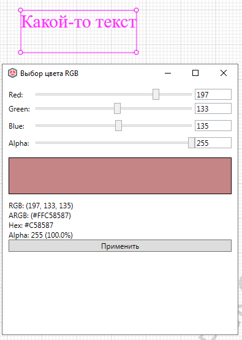

# Задать цвет текста

*Доступно с версии 1.0.0*

Команда предполагает, что на момент её вызова Пользователь выбрал в 
модели один или несколько объектов "Текст модели" или один или несколько
 "Текст чертежа" в пространстве одного из чертежей:

После запуска появится окно с возможностью задания цвета по RGB кодам (либо сдвигая ползунок, либо вводя точные численные кода компонентов цвета). После выбора цвета следует нажать на Применить, после чего все абзацы текста будут перекрашены в выбранный цвет.

У текста модели дополнительно появится новое свойство "Bri4ka. Код цвета", которое будет содержать строковый шестнадцатеричный (hex) код цвета. У текстов чертежей свойства отсутствуют, поэтому их назначить невозможно.
