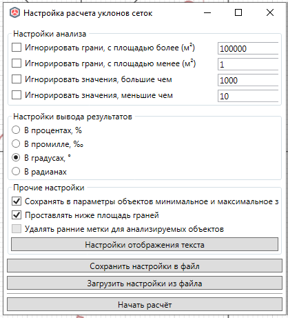
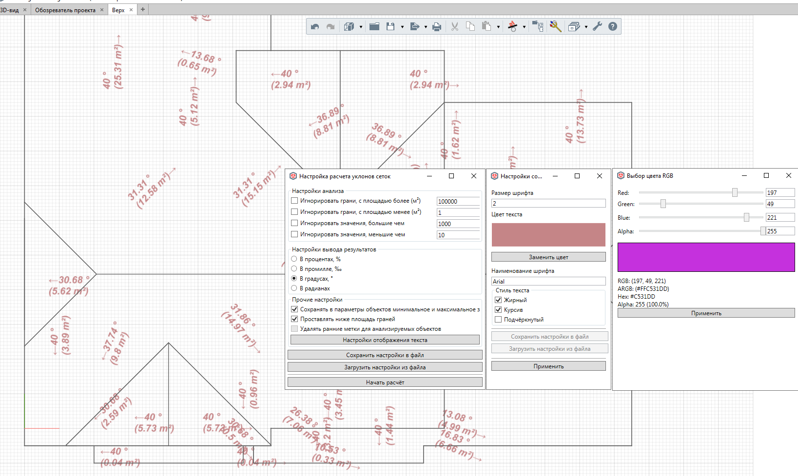

# Вывести уклоны кровли

Анализирует триангулированное представление геометрии объекта модели и для каждой грани вычисляет уклон, который выводит в виде текста модели (численное обозначение и стрелка с направлением уклона).

Перед вызовом команда ожидает, что в модели выбраны анализируемые объекты.

- Если среди объектов имеется кровля, то будет проанализирована только её верхняя плоскость и скаты (при наличии);

- Если среди объектов имеется пандус, то будет проанализирована только его наклонная плоскость;

Из-за невозможности через API указать уровень для создания элементов, задайте  перед начало работы активным целевой уровень, на котором должны быть созданы объекты.

После вызова функции откроется окно настройки параметров. Если какие-либо параметры менялись в ранних сессиях приложения, то они будут восстановлены (то есть окно хранит раннее введенные параметры обработки).

* Настройки анализа: позволяют задать, грани с какой площадью игнорировать, а также какие численные показания уклона (в зависимости от заданных единиц вывода ниже) выводить;
- Настройки вывода результатов: позволяют задать единицы, в которых будет рассчитан уклон и условный знак которого будет записан за числовым значением уклона;

- Сохранять в параметры объектов значения уклонов: заполняет свойства объекта максимальным и минимальным уклонов в данных единицах;

- Проставлять ниже площадь граней: ниже числового значения уклона в скобках будет указана площадь грани в кв. метрах;

- Настройки отображения текста: открывает окно настройки параметров текстовой метки (тип шрифт, размер шрифта, начертание, цвет текста);

- Сохранить настройки в файл: позволяет сохранить настройки обработки в XML-файл;

- Загрузить настройки из файла: позволяет импортировать настройки обработки из XML-файла;

Кнопка "Начать расчет" запускает обработку:

