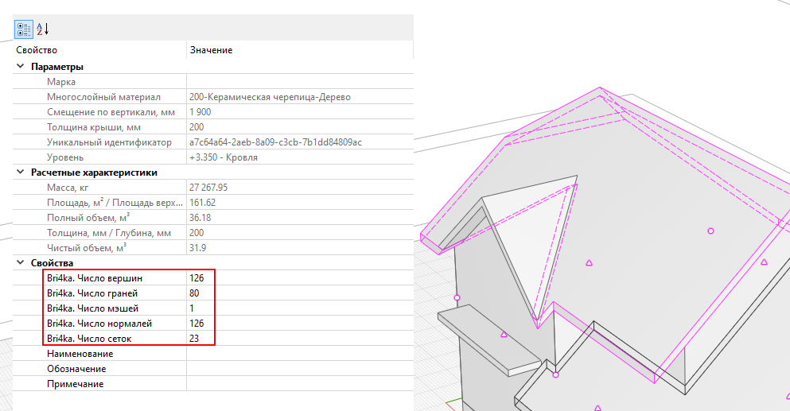

# Подсчитать грани

Выводит в свойства объектов информацию, сколько у приведенной к триангулированному представлению геометрии объекта мэшей, сеток, вершин, граней и нормалей.

После отработки команды у объектов, имеющих геометрию, в свойствах появятся новые заполненные параметры:

