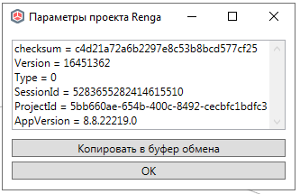

# Вывести метаданные файла

Производит сохранение текущего проекта и считывает текстовую статистическую информацию о модели Renga внутри файла (прочтенного как архив).

> Функция производит копирование файла во временную папку Пользователя для работы с ним во избежание системной ошибки доступа к файлу одновременно с Renga. После анализа копия файла удаляется.

