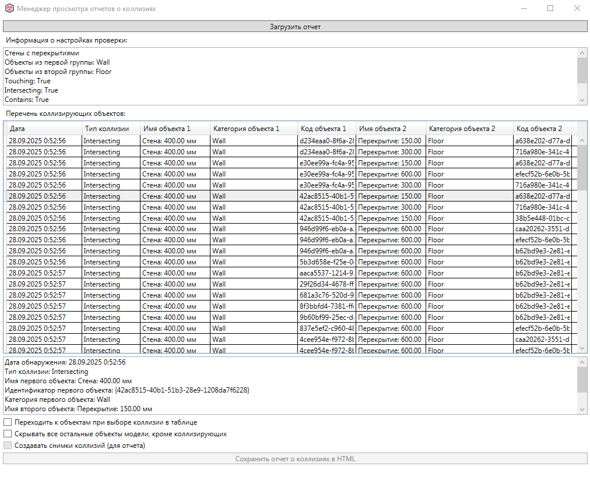
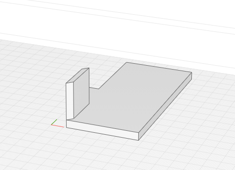

# Посмотреть отчет о коллизиях

*Доступно с версии 1.0.2*

Немодальное окно, позволяющее посмотреть сохраненный отчет о проверках на коллизии, созданный функцией "Проверить на коллизии". Запуск окна открывает отчет по последней по времени проверке. Отчёты хранятся в XML виде в соответствующей папке приложения

`%APPDATA%\Renga Bri4ka Plugin\CollisionReports`

По нажатию на кнопку "Загрузить отчет" можно отобразить в окне иной отчет из файла.

Окно выглядит следующим образом:

При выборе позиции в таблице расширенная информация будет отображена в текстовом поле ниже (режим "только для чтения"). 

Если включен флажок"Переходить к объектам ...", то соответствующие объекты, если они есть в модели, будут выделены:

Если включен флажок "Скрывать все остальные объекты ...", то на экране будут отображены только пара коллизирующих объектов (или менее, если объект был удален, или текущий проект не связан с отчетом о коллизиях). При первом флажке отображенные объекты будут дополнительно выбраны.

Кнопка "Сохранить отчет о коллизиях в HTML" позволяет сохранить видимый отчет в HTML, по аналогии как делает Autodesk Navisworks. Возможность вставки снимков коллизии (вид сцены с объектами) существует, но пока не реализована (TODO), в этом случае снимки будут храниться в папке "assets" рядом с формируемым HTML-файлом и грузиться туда через относительные пути.
