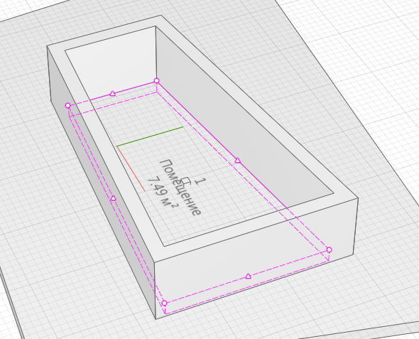

# Перекрытие по помещению

*Доступно с версии 1.0.5*

Не-оконное приложение. Формирует контур перекрытия для выделенных помещений.

Если помещения не выбраны в модели, будет исключение "*RengaBri4ka. Объекты не были выбраны!*" "*RengaBri4ka. Среди выбранных объектов отсутствуют помещения! Выполнение функции будет прервано!*"

⚠Перед началом расчета установите текущим уровень, на котором будут созданы перекрытия!

