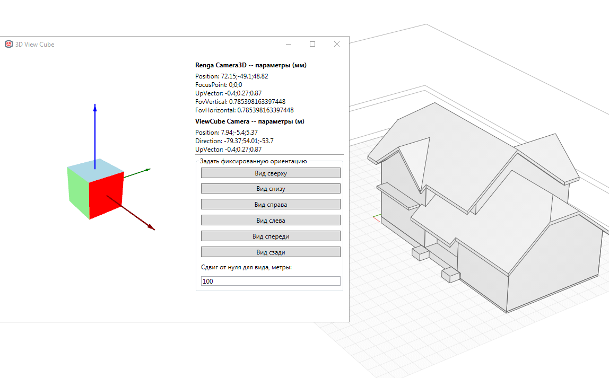

# Видовой куб

*Доступно с версии 1.0.6*

Немодальное окно. Содержит видовой куб с осями координат, параметры текущей камеры и кнопки задания вида модели.

Обновляет данные только при нахождении Пользователя в пространстве модели. Время обновления -- каждую 1 секунду. Время пока нельзя редактировать из окна.

В левой части окна располагается сам видовой куб и сетка осей. В правой части -- текстовая информация о камерах (сверху -- оригинальные значения настроек камеры Renga, ниже -- приведенные настройки камеры для видового куба).

Возможно задать положение камеры с одной из сторон куба -- для этого нажмите на соответствующую кнопку в группе команд "Задать фиксированную ориентацию". Расстояние, на которое будет удалена камера от начала координат в метрах -- это значение текстового поля "Сдвиг от нуля". Значение сдвига можно изменить, если введенные данные корректны, то они будут применены для следующих сдвигов. Если нет, то будет использоваться стандартное значение 100 метров.
