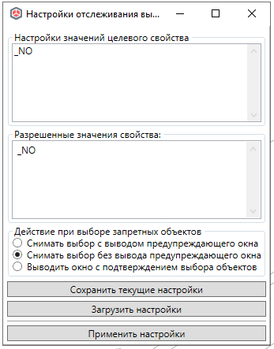
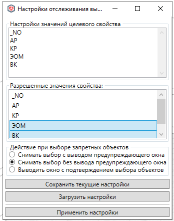

# Запрет выбора

*Доступно с версии 1.0.7*

Модальное окно с настройками.

Попытка реализации функции блокировки изменений объектов, сделано на базе [существовавшей ранней разработки](https://github.com/GeorgGrebenyuk/Renga_FollowUsersActions). Так как в самой Renga и её API отсутствует механизм выборочной блокировки объектов, то при совместной работе имеют место случаи их случайного изменения. Настоящая функция предлагает свой сценарий блокировки: при попытке выбрать запрещенный объект выбор будет сбрасываться (можно настроить, будет ли выскакивать предупреждение или нет). Критерием доступности выбора будет заданное соотношение в настройках функции -- объекты с какими значениями специального свойства текущему пользователю **можно** будет выбирать выбирать.

В отличие от упомянутой выше ранней реализации в данной функции сделано упрощение порядка настройки опций, сохранение настроек автоматически для данного ПК.

## Порядок использования

При вызове функции в первый раз на данном ПК окно будет выглядеть следующим образом:

Сперва необходимо задать значения свойства, которое будет использоваться для ограничения пользовательского выбора. Введите значения в первое текстовое поле, каждое значение с новой строки (пользуйтесь Enter для переноса строки). После этого нажмите на "Применить настройки". Настоящее окно закроется, и произойдет регистрация в текущем проекте Renga нового определения свойства "Bri4ka. Отслеживание пользовательского выбора" с идентификатором `61a27b1d-60f3-4a70-94b8-5f72252021c9`, характерного для всех категорий Renga и типом "Перечисление" и заданными значениями. 

> Рекомендация: не удаляйте и не редактируйте положение первого значения "_NO", оно назначается по умолчанию и при его наличии в значении свойства выбор сбрасываться не будет

Если это не первый запуск функции, и данное свойство уже имело какие-то значения, то они будут перезаписаны для новых условий.

Теперь необходимо вызвать окно во второй раз и во второй форме "Разрешенные значения свойства" выбрать значения свойств, объекты значениями которых пользователю можно будет выбирать в модели.

Для снятия выбора просто выберите этот элемент ещё раз и выбор снимется. Выберите поведение Renga при выборе объектов -- по умолчанию "без вывода предупреждающего окна" и снова нажмите на "Применить настройки".

Всё - теперь можете свободно работать с данными. При желании изменить настройки вы можете в любой момент вызвать данную функцию, внести изменения и их применить.

Произвести массовое редактирование значений свойств можно стандартным способом, выбрав группу объектов, вызвав у них стандартное окно "Свойства" и задав для объектов группы нужное значение свойства "Bri4ka. Отслеживание пользовательского выбора".

Текущие настройки будут хранится в конфигурации 

`%APPDATA%\Renga Bri4ka Plugin\Configs\RengaManageSelectPermissionsConfig\Default.xml`

Вы можете сохранить настройки и передать их/загрузить из файла при помощи кнопок выше.

