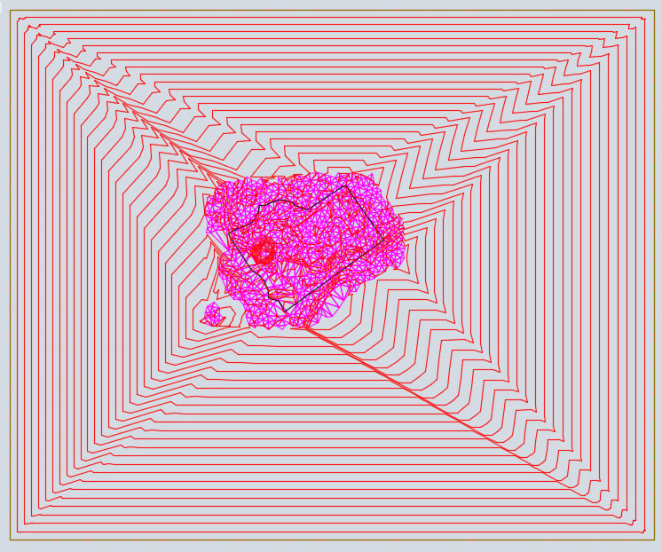
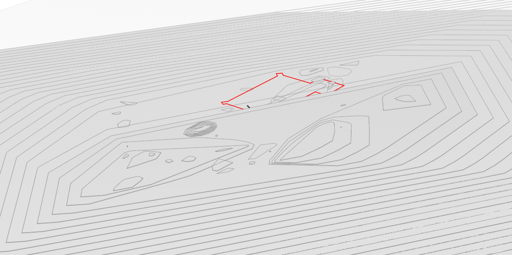
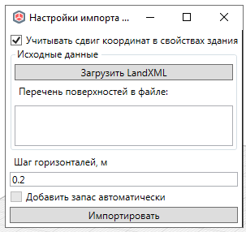

# Импорт рельефа

*Доступно с версии 1.0.8*

Модальное окно с настройками.

Возможность импорта в модель Renga поверхности топографии из обменного файла LandXML (должен поддерживаться всеми САПР, где ведется разработка генплана, линейных объектов).

Поверхность отрисовывается в виде набора перекрытий по горизонталям (шаг настраивается), толщина перекрытий = шагу горизонталей.

Чтение координат поверхности из LandXML осуществляется с учетом глобального сдвига координат, установленного в свойствах Здания проекта Renga -- поля `IfcLocationX`, `IfcLocationY`, `IfcLocationZ`, `IfcDirectionPrecession`, необходимые для экспорта проекта в IFC (см. справку Renga, [статью об экспорте в IFC](https://help.rengabim.com/ru/index.htm#ifc.htm), раздел "Определение расположения здания").

## Требования к поверхностям

Команда ожидает, что внутри определения поверхности в LandXML находится коллекция вершин и граней. Если оригинальная поверхность была образована структурными линиями, то грани в файл не попадают, и нужно поверхность в исходной САПР построить на базе треугольников.

Так как в общем случае горизонтали поверхности представляют собой замкнутые и незамкнутые контуры, обрезаясь по границе поверхности, в составе поверхности в исходной САПР необходимо добавить структурную линию по габаритам поверхности с запасом на отметку чуть ниже минимальной отметки поверхности:

Если этого не сделать, многие горизонтали не получится построить.

Тогда результат в renga будет таким:

## Порядок использования

При вызове функции окно настроек выглядит так:

Необходимо нажать на кнопку "Загрузить LandXML" и указать путь к файлу.

Так как в файле может быть несколько поверхностей, их имена выводятся в соответствующем списке под кнопкой. Пользователю необходимо выбрать мышкой поверхность для импорта.

При необходимости можно задать значение шага горизонталей. 

После применения настроек нажать на "Импортировать". Пример результата см. на картинке выше.

## 

## 
