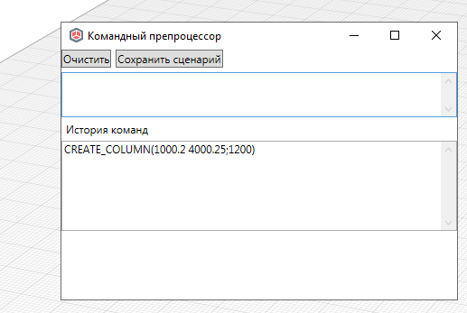
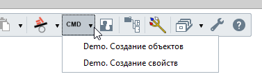

# Командный препроцессор

*Доступно с версии 1.0.9*

Немодальное окно с имитацией командной строки (как в AutoCAD и аналогах) и командными методами на редактирование модели. Группу команд будем называть "командный сценарий".

## Принцип использования

По нажатию на функцию появляется немодальное окно (не блокирующее прочую работу в Renga), его удобнее сместить, например, вниз рабочей области документа, либо вывести на иной монитор.



Командный препроцессор действует по принципу "Одна строка -- одна команда". Символ новой строки `\n` или нажатие на Enter подразумевает выполнение команды. Возможна вставка из буфера обмена ряда команд `Ctrl + V`. Доступные команды перечислены ниже.

Принцип ввода координат взят из известного "[Well known text](https://en.wikipedia.org/wiki/Well-known_text_representation_of_geometry)", популярного в ГИС.

Сохранить набор команд можно нажав на кнопку "Сохранить сценарий", далее см. подраздел "Избранные сценарии" ниже.

## Доступные команды

Сперва перечислим некоторые вспомогательные структуры из WKT, используемые при описании геометрии в колонке "Тело запроса":

* "WKT_LINESTRING" = `30 10,10 30,40 40`;

Для задания замкнутых контуров не дублируйте первую и последнюю точки, в этом случае объект будет создан с ошибкой;

**Примечание**: Напротив команды указана требуемая версия Renga для выполнения команды. В противном случае команда не будет выполнена или возникнет ошибка. Если версия не указано, то должно работать везде (с 7.0 -- ограничение плагина).

Значки ✅ и ⚠️ означают функциональность команд по крайней мере на версии 8.10.

Не обрезанную версию таблицы ниже см. [в файле]().

| Имя команды         | Описание                               | Тело запроса                       | Комментарий                                                                                                                                                                                                                                                                        | Версия    | Test |
| ------------------- | -------------------------------------- | ---------------------------------- | ---------------------------------------------------------------------------------------------------------------------------------------------------------------------------------------------------------------------------------------------------------------------------------- | --------- | ---- |
| SET_LEVEL_ACTIVE    | Установить заданный уровень активным   | (LEVELNAME)                        | LEVELNAME = имя уровня                                                                                                                                                                                                                                                             | 8.6       | ✅    |
| CREATE_BEAM         | Создать балку                          | (POINT3D_START; POINT3D_END)       | Не задает геометрию                                                                                                                                                                                                                                                                | 8.9       | ⚠️   |
| CREATE_COLUMN       | Создать колонну                        | (POINT2D;HEIGHT)                   |                                                                                                                                                                                                                                                                                    | 8.6       | ✅    |
| CREATE_FLOOR        | Создать перекрытие                     | (WKT_LINESTRING; THICKNESS)        | THICKNESS - толщина перекрытия                                                                                                                                                                                                                                                     | 8.7       | ✅    |
| CREATE_ROOF         | Создать кровлю                         | (WKT_LINESTRING; THICKNESS)        | С версии Renga 8.10                                                                                                                                                                                                                                                                | 8.10      | ✅    |
| CREATE_WALL         | Создать стену                          | (WKT_LINESTRING; THICKNESS;HEIGHT) | Не задает геометрию                                                                                                                                                                                                                                                                | 8.7       | ⚠️   |
| CREATE_LINE         | Создать линию                          | (WKT_LINESTRING)                   | Не задает геометрию<br/>Если вызов в модели -- то Line3D (8.9); если в чертеже -- то DrawingLine (8.10)                                                                                                                                                                            | 8.9, 8.10 | ⚠️   |
| CREATE_TEXT         | Создать текст                          | (WKT_LINESTRING; TEXT)             | TEXT -- в кавычках, в виде 1 строки. Символы-разделители будут удалены. <br/>Если вызов в модели -- то ModelText (8.6); если в чертеже -- то DrawingText (8.8)                                                                                                                     | 8.6, 8.8  | ✅    |
| CREATE_HATCH        | Создать штриховку                      | (WKT_LINESTRING)                   |                                                                                                                                                                                                                                                                                    | 8.7       | ✅    |
| CREATE_PROPERTY     | Создать определение свойства           | (NAME;PROPTYPE;ASSIGNTYPES)        | PROPTYPE -- перечисление Renga.PropType, кроме Enumeration<br/> ASSIGNTYPES - перечисление через пробел наименований категорий объектов Renga на латинице (см. [перечень](https://help.rengabim.com/api/group___entity_types.html) жирным текстом). Если пустое = ко всем объектам |           | ✅    |
| CREATE_PROPERTY2    | Создать определение свойства с Id      | (NAME;GUID;PROPTYPE;ASSIGNTYPES)   | То же, только Id в виде строкового Guid                                                                                                                                                                                                                                            |           | ✅    |
| CREATE_PROPERTYENUM | Создать определение свойства ENUM      | (NAME;ENUMS;ASSIGNTYPES)           | То же, что и CREATE_PROPERTY, только для свойств с типом Enumeration<br/>ENUMS - перечисление через ПРОБЕЛ строк                                                                                                                                                                   |           | ✅    |
| CREATE_PROPERTYENUM | Создать определение свойства ENUM с Id | (NAME;GUID;ENUMS;ASSIGNTYPES)      | То же, только Id в виде строкового Guid, 32-символьная строка без кавычек, тире, скобок                                                                                                                                                                                            |           | ✅    |

Примечания: 

1. координаты любых точек записываются в круглых скобках, разделитель между компонентами координат XYZ - пробел. Размерность точек указана в теле запроса (если POINT3D -- то трехмерная точка, если POINT2D-то плоская точка);

2. Разделитель дробной части - ТОЧКА (в координатах точек, в значениях дробных чисел);

3. Все объекты создаются на текущем уровне. Для установки иного используйте команду `SET_LEVEL_ACTIVE`;

4. ⚠️На Renga 8.10 для отрисовки балок, стен, линии модели и линии чертежа имеются проблемы -- элементы задаются с геометрией по умолчанию в игнор параметров. Ошибка **SD#7566028** (можете попросить сделать взять на карандаш тоже :);

5. Строки, не содержащие какой либо команды игнорируются. Можете использовать их для комментариев. Но желательно, для единообразия, комментарии предварять символами `::`;

6. Аргумент PROPTYPE в параметрах создания свойства принимает следующие значения:

```cs
PropertyType_Double = 1
PropertyType_String = 2
PropertyType_Angle = 3
PropertyType_Area = 4
PropertyType_Boolean = 5
PropertyType_Integer = 7
PropertyType_Length = 8
PropertyType_Logical = 9
PropertyType_Mass = 10
PropertyType_Volume = 11
```

Здесь не приведены типы `PropertyType_Undefined = 0`(не использовать вообще) и `PropertyType_Enumeration = 6`(вместо этого используйте `CREATE_PROPERTYENUM` и\или `CREATE_PROPERTYENUM2`);

7. Аргумент GUID в параметрах создания свойств может быть `b0d7051cee8e4cf2aa78be758bca1998`, `{56469ab02a2c4001bf350e4c8ff53db8}`, `45e87828-4a8e-43f9-8e3c-d7ae4994fac8`, главное -- без КРУГЛЫХ скобок;

### Примеры

Создание объектов

```batch
:: Установка активным уровня с именем "TEST1"
SET_LEVEL_ACTIVE(TEST1)

::Создание колонн
CREATE_COLUMN(0.2 4000.25;1000)
CREATE_COLUMN(1000.2 4000.25;1200)

::Создание перекрытия
CREATE_FLOOR(0 0, 0 1000,1000 1000, 1000 0;500)

::Создание кровли
CREATE_ROOF(-3000 -2000, 3000 2000,4500 3500, 8000 0;500)

::Создание штриховки
CREATE_HATCH(-3000 -2000, 3000 2000,4500 3500, 8000 0;500)

:: Создание текста
CREATE_TEXT(2000 2000;"Привет, Renga!")
```

Создание определений свойств

```batch
:: Создание простого свойства
CREATE_PROPERTY(Bri4ka. Толщина;1;Beam Roof Wall)

:: Создание простого свойства c идентификатором
CREATE_PROPERTY2(Bri4ka. Высота;80986e15-795c-4dec-929d-783578129826;1;Beam Roof Wall)

:: Свойство типа перечисление для всех типов объектов
CREATE_PROPERTYENUM(Bri4ka. Статус;Сделано Отложено Отозвано;)

:: Свойство типа перечисление c идентификатором
CREATE_PROPERTYENUM2(Bri4ka. Статус коллизии;{45e87828-4a8e-43f9-8e3c-d7ae4994fac8};Отредактирована Новая Обнаружена;Wall Floor)
```

## Избранные сценарии

Сценарии из одной или нескольких команд можно сохранить на ПК для последующего использования в новой сессии Renga.

Сохраните файл сценария в виде текстового файла с расширением `.txt` в папке 

`%APPDATA%\Renga Bri4ka Plugin\CmdScenarios`. Сохранять в кодировке UTF-8, иначе символьные записи пойдут с кракозябами.

При следующем запуске Renga справа от меню появится новое меню с выпадающим списком и именами файлов сценариев. По нажатию на сценарий автоматически запустится его исполнение.


