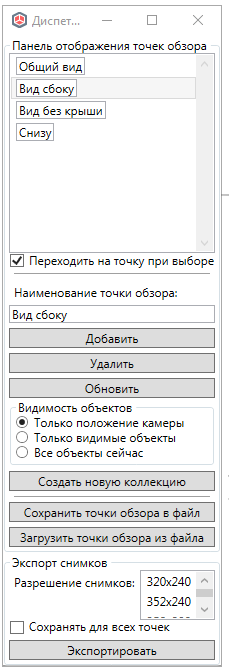
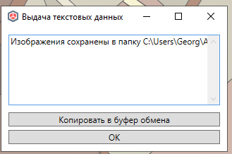

# Точки обзора

*Доступно с версии 1.1.0*

Немодальное окно с возможностью сохранения точек обзора с видимостью элементов Renga.

Адаптация ранней реализации от другого разработчика

[GitHub - GeorgGrebenyuk/renga_view_points: Плагин для Renga для сохранения пользовательских точек обзора с активным скрытием элементов на видах](https://github.com/GeorgGrebenyuk/renga_view_points)

Информация о точках обзора хранится в привязке к текущем идентификатору проекта Renga (если файл сохранять через "Сохранить" и "Сохранить как", то этот идентификатор остаётся прежним). Если Вы загрузите свой набор точек через "Загрузить точки обзора из файла", то сохранение изменений будет производиться в него. Если поданный файл лежит в папке с другими точками  обзора по пути `%APPDATA%\Renga Bri4ka Plugin\Configs\ViewPointsCollectionConfig`, то он будет загружен автоматически при следующем запуске команды. В противном случае вам надо будет загружать его всякий раз вручную.

## Использование

После вызова окно команды выглядит так для нескольких сохраненных точек 

Добавить новую точку обзора можно при помощи одноименной команды. Сохранятся текущее положение камеры, визуальный стиль, настройки видимости объектов:

* "Только положение камеры" -- при перемещении к точке обзора будет меняться только положение камеры и визуальный стиль, состав объектов меняться не будет;

* "Только видимые объекты" -- сохранятся только видимые в данный момент на виде объекты, при переходе к точке будут показаны только они;

* "Все объекты сейчас" -- если какие-либо объекты будут добавлены после сохранения опции, то они не будут отображены при переходе на неё;

Кнопка "Удалить" удаляет точку из коллекции точек обзора.

Новая точка создается с префиксом `ViewPoint` по умолчанию, если не задан иной текст в поле "Наименование точки обзора". Вы можете переопределить имя после создания, введя нужное в упомянутое выше текстовое поле и нажать "Обновить". Обновление также коснется и параметров положения камеры, визуального стиля, настроек видимости объектов.

Всякое обновление точек обзора (добавление, удаление, изменение) тянет за собой процесс сохранения данных для текущего проекта. Данные сохраняются в папку`%APPDATA%\Renga Bri4ka Plugin\Configs\ViewPointsCollectionConfig`. Если это первый запуск окна (не важно, в сессии Renga или после его закрытия), то будет прогружен последний по дате изменения конфиг для данного проекта или пустая коллекция, если выбран пользовательский набор точек -- то он, если вызвана команда "Сохранить точки обзора в файл" - то в выбранный там файл; во всех остальных случаях сохранение производиться не будет.

При вызове команды "Создать новую коллекцию" текущая коллекция точек обзора будет сохранена, если путь был задан, после сего точки сброшены. До вызова команды "Сохранить точки обзора в файл" данные о новых точках не будут сохраняться.

## Экспорт сцены в файл

Имеется возможность для выбранной точки обзора или сразу для всех сохранить сцену в изображение. Для этого воспользуйтесь кнопкой "Экспортировать" внизу окна. Для выбора всех точек обзора установите соответствующий флажок. Разрешение изображений по умолчанию = "1280x1024", при желании изменить выберите соответствующее из выпадающего списка.

Данные будут сохранены в папке плагина для данного проекта. Путь будет выведен в справочном окне после окончания отработки функции

