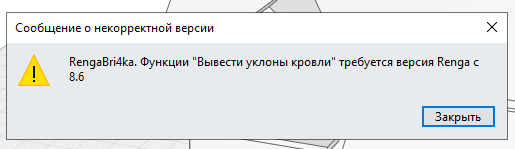

# Совместимость с версиями Renga

Настоящий плагин должен работать на версиях Renga с 7.0 в обоих редакциях Standard и Professional (редакция на `net48`, подробнее см. информацию из [Руководства по установке](.\1.1_INSTALL.md)). Некоторые функции плагина будут не доступны на версии Renga Standard (имеющие отношение к работе с IFC и импорту STDL файлов), предупреждение об этом будет сформировано при попытке вызова соответствующих функций.

Рекомендуется использовать плагин на версиях с 8.6, когда в API появились функции, позволяющие создавать объекты.

Если запускаемая команда содержит обращение к функциям API, доступным в поздних версиях API, то будет выброшено исключение:

> Если вы используете Windows 11 и по каким-либо причинам редакция на `net48` не загружается в Renga, используйте редакцию плагина на `.NET 8`
