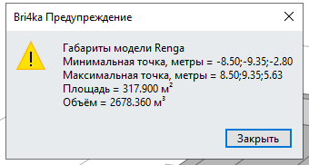
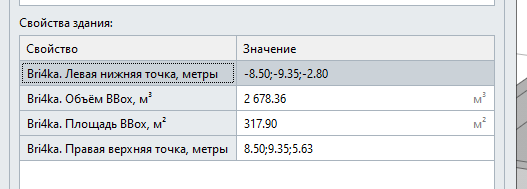

# Задать свойства габарита

*Доступно с версии 1.1.2*

Функция без каких-либо настроек.

Если в модели есть сборки, то добавляет для каждой информацию по свойствам ограничивающей рамки (все единицы в метрах):

- Bri4ka. Левая нижняя точка, метры;

- Bri4ka. Правая верхняя точка, метры;

- Bri4ka. Площадь BBox, м²;

- Bri4ka. Объём BBox, м³;

> Для сборок почему-то не считается, возможно проблемы в API ...

Также рассчитывает те же параметры для всей модели и сохраняет их в свойства Здания, а также выводит в информационном окне для Пользователя;

