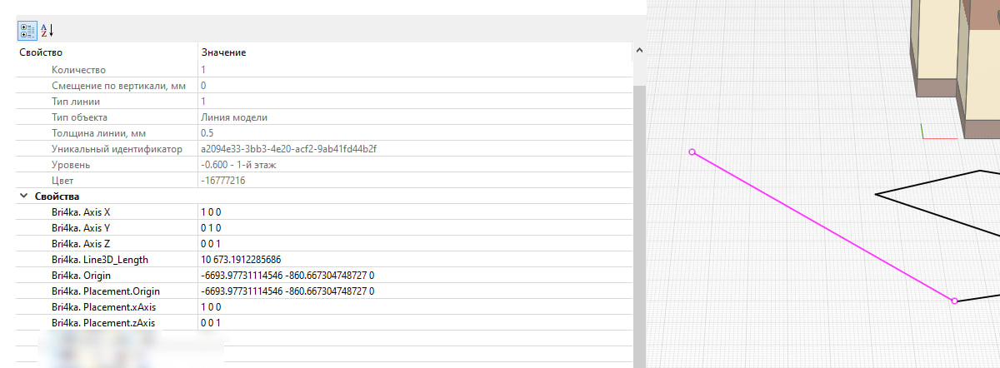

# Задать свойства положения

*Доступно с версии 1.1.1*

Команда без настроек. При запуске запускается анализ объектов в модели. Для объектов, расположенных на уровнях (приводимых к интерфейсу `ILevelObject`), приводимых к 2D-объектам (приводимых к интерфейсу `IPlacement2DObject`) извлекаются параметры положения Placement3D и Placement2D соответственно. В число свойств объектов вносятся соответствующие свойства компонентов параметров Placement:

- Bri4ka. Axis X;

- Bri4ka. Axis Y;

- Bri4ka. Axis Z; (только для Placement3D)

- Bri4ka. Origin;

- Bri4ka. Placement.Origin;

- Bri4ka. Placement.xAxis;

- Bri4ka. Placement.zAxis; (только для Placement3D)

У Placement2D отсутствуют Z-компоненты перечисленных выше свойств. Разделитель координат "пробел".

Для линий модели (приводимых к интерфейсу `ILine3DParams`) дополнительно в свойство "Bri4ka. Line3D_Length" фиксируется длина линии.

