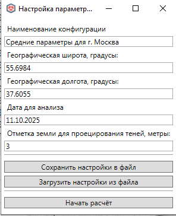
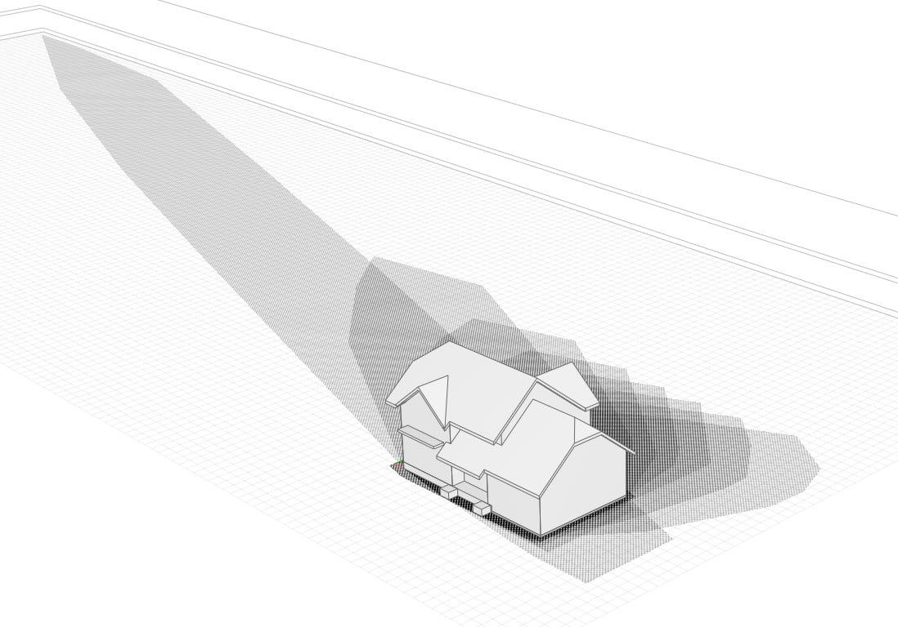

# Построить тени

*Доступно с версии 1.0.5*

Модальное окно, задает настройки местоположения здания и настройки расчета зоны затенения на плоскости, образованной геометрией здания.

Окно выше позволяет ввести параметры:

- географические широта и долгота -- примерные координаты места проектирования, на основе которых для заданной даты будут рассчитаны время восхода и захода Солнца, положения Солнца в каждый расчетный час;

- дата для анализа - день года, для которого рассчитывается положение Солнца на небе. По умолчанию = текущей;

- Отметка земли, высота на которую проецируется тень, по умолчанию = 0 (отметка земли), опция тестовая, может давать неверные результаты при отличной от нуля;

Кнопка "Начать расчет" запускает обработку геометрии для заданных настроек анализа.

Имеет смысл анализировать только геометрию кровли и перекрытий. Если перед запуском расчета выбрать объекты в модели, то будут анализироваться только они. В противном случае будут считаться все перекрытия и кровли, имеющиеся в модели.

⚠Перед началом расчета установите текущим нулевой уровень, соответствующий поверхности земли (отметка проецирования солнечных лучей по умолчанию = 0, может быть).

Результатом работы функции будут штриховки , границы которых будут образовывать полный контур затенения. В центре каждой из штриховок будет создан текст модели со значением расчетного часа, для которого они сформированы.

